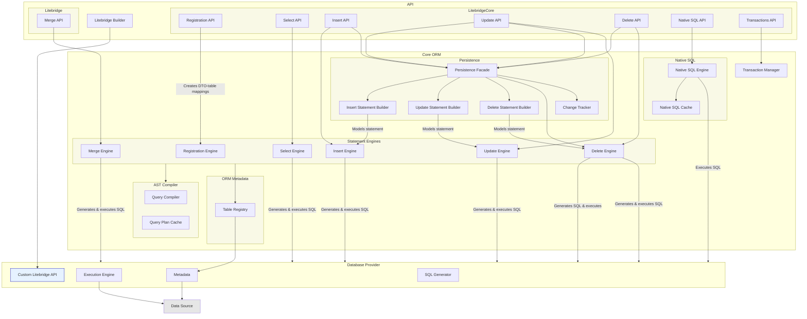

# Litebridge Architecture

## Component diagram

A high-level component diagram of Litebridge is provided below:

## Basic API flow

The `Litebridge` instance is the primary entry point to accessing Litebridge's functionality. 
Its actual implementation is dependent on the `DatabaseProvider` instance used, allowing 
the database provider to limit or extend the Litebridge API to support vendor-specific features.
All custom instances of Litebridge must extend `LitebridgeCore` at a minimum.

The API itself is a lightweight, fluent API that generates a chain of `QueryNode` instances which are evaluated
against a query structure cache before SQL generation. If the query's hash isn't found in the cache, one of the 
core ORM's statement engines will compile the query node chain into a logical model of the SQL operation
(e.g. a `Select`, `Insert`, etc) using the `QueryCompiler`. The result is passed to the `DatabaseProvider` for SQL string generation. 
The generated SQL string is cached with metadata, and the statement is executed with extract bind parameters.
Subsequent executions of the same structural query skip the query compilation and SQL generation phases due to the cached data.

