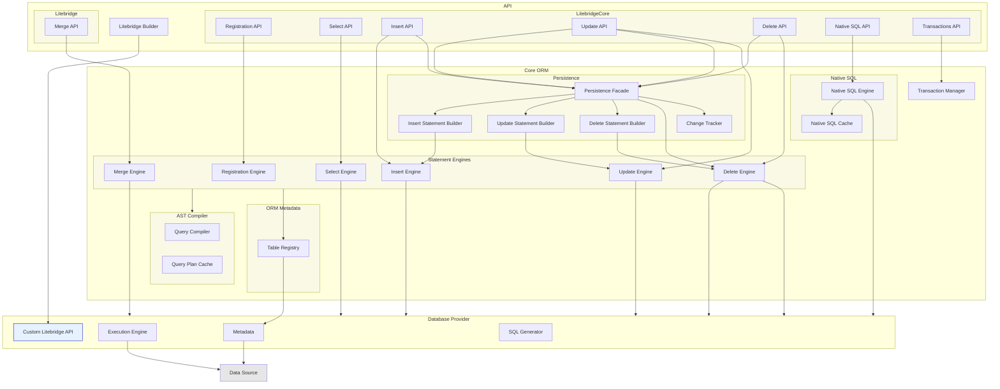

# Litebridge Architecture

A high-level component diagram of Litebridge is provided below:

```mermaid
flowchart TB
    subgraph ApiGroup [API]
        LitebrideBuilder[Litebridge Builder]
        
        subgraph LitebridgeCoreGroup [LitebridgeCore]
            RegistrationApi[Registration API]
            SelectApi[Select API]
            InsertApi[Insert API]
            UpdateApi[Update API]
            DeleteApi[Delete API]
            NativeSqlApi[Native SQL API]
            TransactionsApi[Transactions API]
        end
        style LitebridgeCoreGroup fill:#f9f9e6

        subgraph LitebridgeGroup [Litebridge]
            MergeApi[Merge API]
        end
        style LitebridgeGroup fill:#f9f9e6
    end

    subgraph CoreOrmGroup [Core ORM]
        TransactionManager[Transaction Manager]
        subgraph OrmMetadata [ORM Metadata]
            TableRegistry[Table Registry]
        end
        style OrmMetadata fill:#f9f9e6
        
        subgraph PersistenceGroup [Persistence]
            ChangeTracker[Change Tracker]
            PersistenceFacade[Persistence Facade] 
            InsertStatementBuilder[Insert Statement Builder]
            UpdateStatementBuilder[Update Statement Builder]
            DeleteStatementBuilder[Delete Statement Builder]
        end
        style PersistenceGroup fill:#f9f9e6
        
        subgraph EngineGroup [Statement Engines]
            RegistrationEngine[Registration Engine]
            SelectEngine[Select Engine]
            InsertEngine[Insert Engine]
            MergeEngine[Merge Engine]
            UpdateEngine[Update Engine]
            DeleteEngine[Delete Engine]
        end
        style EngineGroup fill:#f9f9e6
        
        subgraph NativeSqlGroup [Native SQL]
            NativeSqlEngine[Native SQL Engine]
            NativeSqlCache[Native SQL Cache]
        end
        style NativeSqlGroup fill:#f9f9e6
        
        subgraph QueryCompilerGroup [AST Compiler]
            QueryCompiler[Query Compiler]
            QueryPlanCache[Query Plan Cache]
        end
        style QueryCompilerGroup fill:#f9f9e6
    end

    subgraph DatabaseProvider [Database Provider]
        SqlGenerator[SQL Generator]
        ExecutionEngine[Execution Engine]
        DatabaseProviderMetadata[Metadata]
        CustomLitebridge[Custom Litebridge API]
        style CustomLitebridge fill:#e6f2ff,stroke:#00b,stroke-width:1px
    end

    DataSource[Data Source]
    style DataSource fill:#e6e6e6
    
    RegistrationApi --> RegistrationEngine
    MergeApi --> MergeEngine ---> DatabaseProvider
    SelectApi --> SelectEngine --> DatabaseProvider
    InsertApi --> InsertEngine --> DatabaseProvider
    InsertApi --> PersistenceFacade --> InsertStatementBuilder --> InsertEngine
    UpdateApi --> PersistenceFacade --> UpdateStatementBuilder --> UpdateEngine
    UpdateApi --> PersistenceFacade --> DeleteStatementBuilder --> DeleteEngine
    DeleteApi --> PersistenceFacade --> DeleteEngine --> DatabaseProvider
    PersistenceFacade --> ChangeTracker
    UpdateApi --> UpdateEngine --> DatabaseProvider
    DeleteApi --> DeleteEngine --> DatabaseProvider
    NativeSqlApi --> NativeSqlEngine --> DatabaseProvider
    TransactionsApi --> TransactionManager
    EngineGroup --> QueryCompilerGroup
    NativeSqlEngine --> NativeSqlCache
    EngineGroup --> TableRegistry
    TableRegistry --> DatabaseProviderMetadata
    LitebrideBuilder --> CustomLitebridge
    DatabaseProviderMetadata --> DataSource
    ExecutionEngine --> DataSource
```